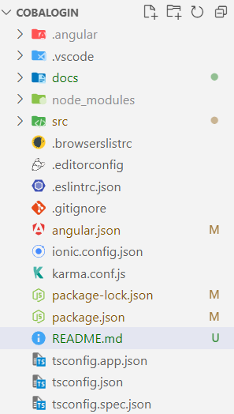
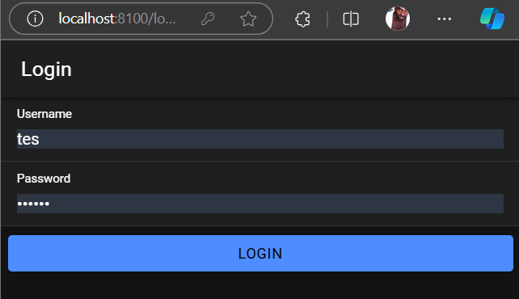
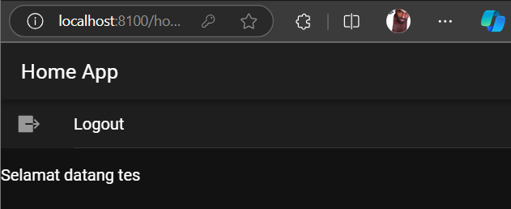
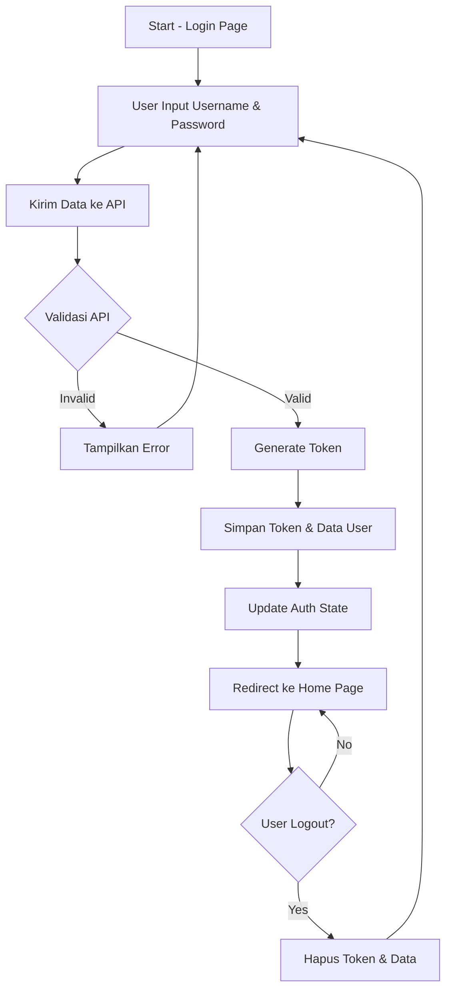

# Tugas 7 - Pertemuan 8

Dibuat oleh:
- Nama: Jehian Athaya
- NIM: H1D022006

## Cara Kerja Login

### 1. Database
```sql
CREATE TABLE user (
    username varchar(100) NOT NULL,
    password varchar(255) NOT NULL
);
```

### 2. API (PHP)
- File `koneksi.php`: Menghubungkan ke database
- File `login.php`: Mengecek username & password, memberikan token jika berhasil

### 3. Komponen Ionic
- `authentication.service.ts`: Mengatur proses login
- `auth.guard.ts`: Mengamankan halaman yang butuh login
- `auto-login.guard.ts`: Mengecek status login otomatis

### 4. Alur Login
1. User input username & password
2. Data dikirim ke API PHP
3. API mengecek ke database
4. Jika berhasil:
   - Dapat token
   - Data disimpan di localStorage
   - User diarahkan ke halaman utama
5. Jika gagal:
   - Tampil pesan error
   - Tetap di halaman login

## Cara Pasang

1. Buat project baru:
```bash
ionic start cobalogin
cd cobalogin
```

2. Install package:
```bash
npm i @capacitor/preferences
```

3. Generate komponen:
```bash
ionic g service services/authentication
ionic g page login
ionic g guard guards/auth --implements CanActivate
ionic g guard guards/autoLogin --implements CanActivate
```

4. Setting database & API:
- Buat database sesuai struktur di atas
- Letakkan file PHP di folder web server
- Sesuaikan URL API di authentication.service.ts

## Screenshot

### Struktur Project


### Halaman Login


### Halaman Home


### Diagram Alur


